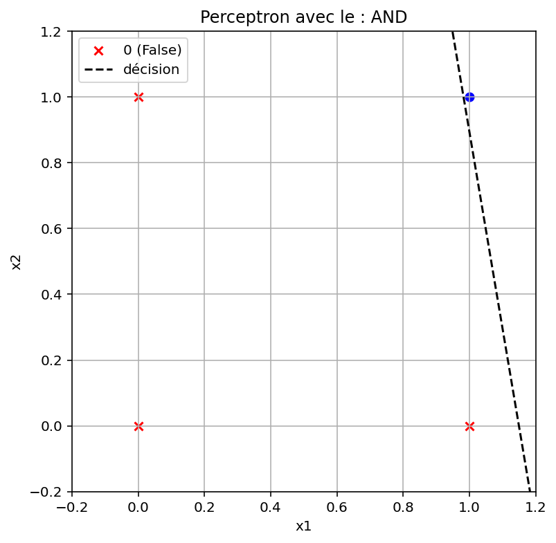
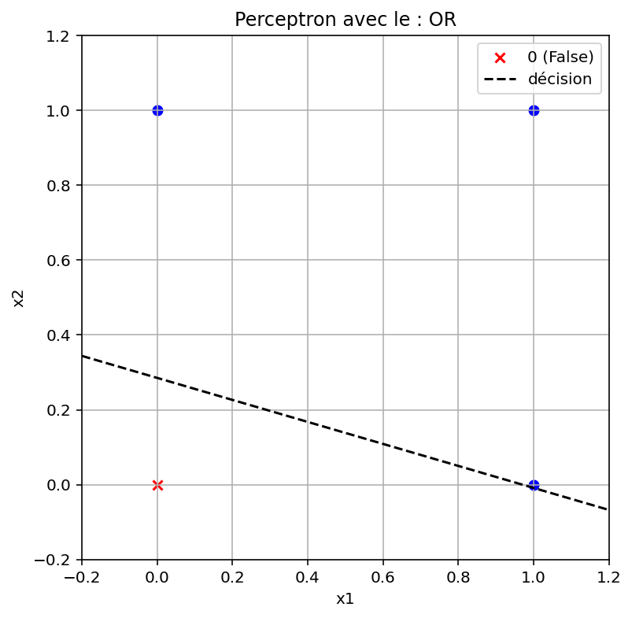
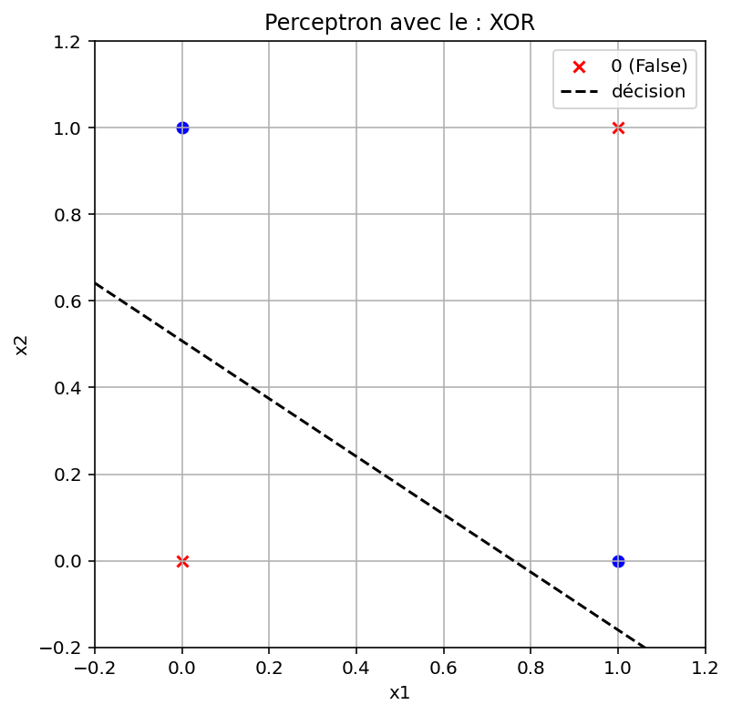
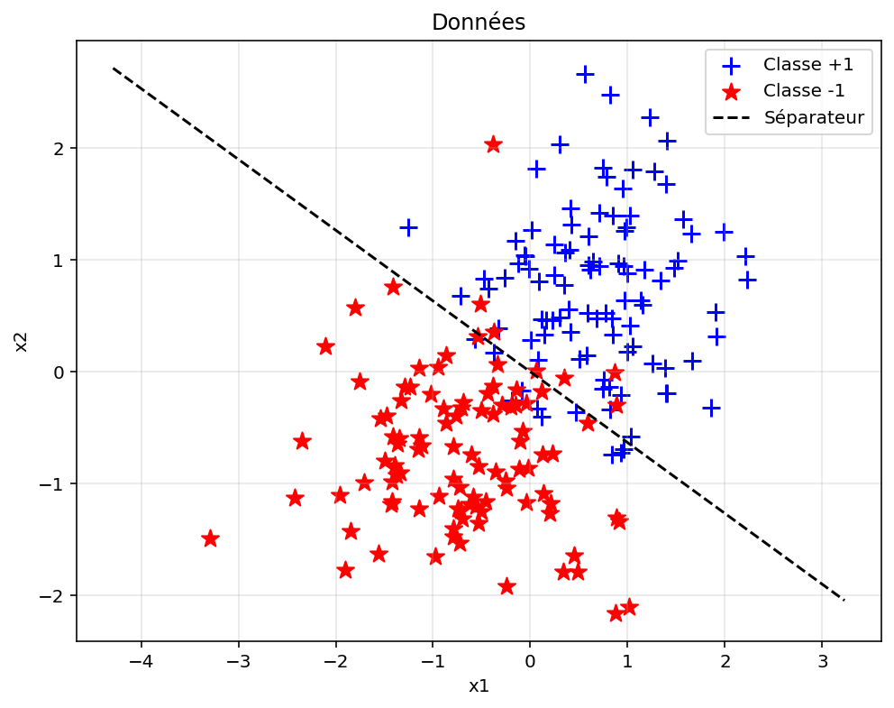
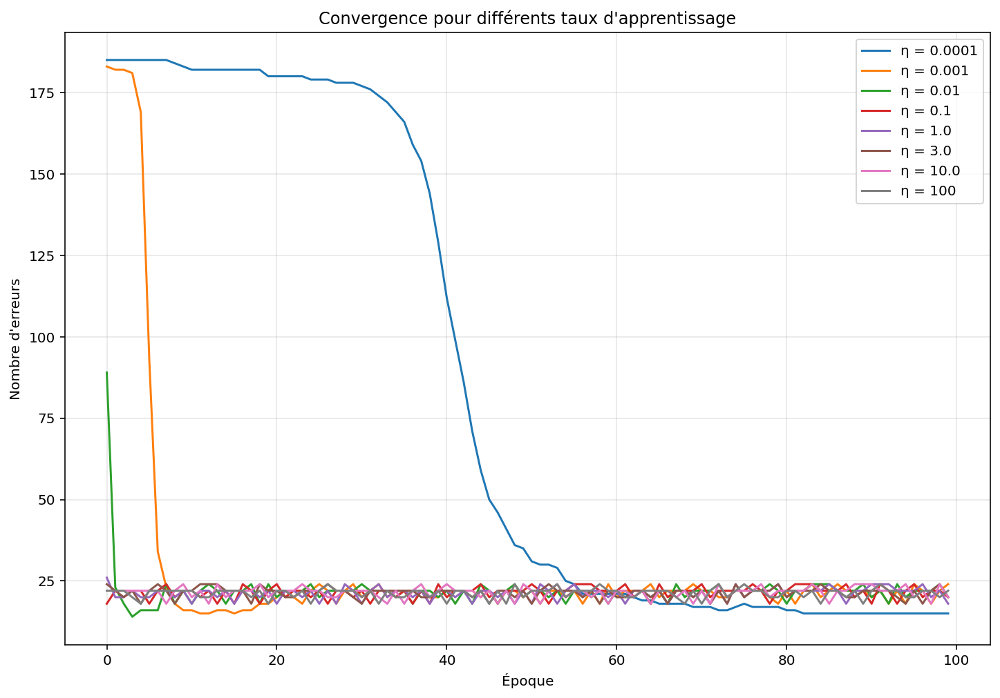
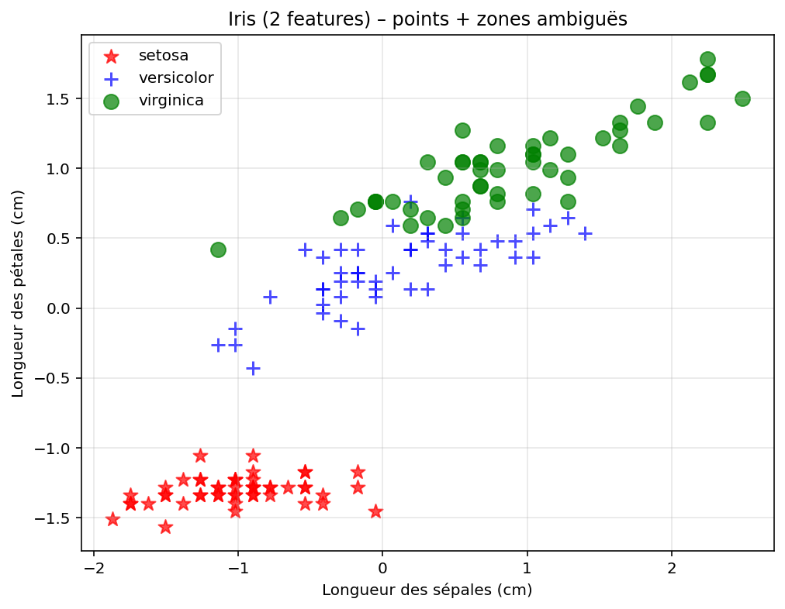

# Exercice 2

    Pourquoi la fonction de Heaviside c'est pas top pour l'apprentissage par gradient ?
    Elle est pas dérivable et sa dérivée est nulle quasi partout. Du coup, impossible de propager le gradient, ce qui bloque tout l’apprentissage avec les méthodes classiques genre descente de gradient.

    Quand utiliser sigmoid ou tanh ?
        Sigmoid : utile en sortie pour donner des probabilités, vu qu’elle donne un truc entre 0 et 1.
        Tanh : mieux dans les couches cachées parce qu’elle est centrée sur 0 (entre -1 et 1), ça aide à mieux apprendre.

    Pourquoi ReLU est-elle si kiffée dans les gros réseaux ?
    Elle est super simple à calculer, et évite que le gradient disparaisse comme avec sigmoid. En plus, elle accélère souvent la convergence.

    C’est quoi le bon côté du leaky ReLU ?
    Le leaky ReLU laisse passer un mini gradient même quand l’entrée est négative. Du coup, ça évite que des neurones "meurent" (ils apprennent plus rien).
# Exercice 3

    Si η est trop grand, ça donne quoi ?
        Le perceptron fait le yoyo, il saute autour de la bonne solution sans jamais s’y poser.
        Parfois il apprend plus rien du tout, ça diverge.
        Il peut juste passer à côté de la solution sans la voir.

    Et si η est trop petit ?
        Alors là, c’est super lent. Il apprend mais faut être patient.
        Parfois il s’arrete trop tôt.
        Mais c’est stable, t’as le temps de faire une pause café entre deux epochs.

    Y a-t-il une valeur magique pour η ?
    Non pas vraiment. En général on tape dans du 0.01 à 0.2, mais ça dépend du dataset.

    On peut changer η en cours de route ?
    Ouais ! Tu commences avec un gros η pour aller vite, puis tu le diminues pour mieux ajuster.

    Une idée de stratégie ?
    Baisser η à chaque itération (learning rate decay). Rapide au début, précis à la fin.

# Exercice 5 :
# Pour la fonction AND
    Combien d'époques sont nécessaires pour converger ?
    12 époques
    Visualisez la droite de séparation trouvée

    Le perceptron converge-t-il toujours vers la même solution ? (ie les mêmes poids)
    Non

# Pour la fonction OR
    Combien d'époques sont nécessaires pour converger ?
    6 époques
    Visualisez la droite de séparation trouvée

    Le perceptron converge-t-il toujours vers la même solution ? (ie les mêmes poids)
    Non
Exercice 6 :
## Pour la fonction XOR
    Combien d'époques sont nécessaires pour converger ?
    Après 100 époques le perceptron n'a toujour pas converger
    Visualisez la droite de séparation trouvée

    Le perceptron converge-t-il toujours vers la même solution ? (ie les mêmes poids)
    Non

# Exercice 7:

# Exercice 8
## Taux d’apprentissage très petit ?
Quand lr est très petit le perceptron met beaucoup de temp à converger
## Taux d’apprentissage trop grand ? 
Le perceptron ne va pas arriver à converger
## Y a un taux d’apprentissage idéal ?
Si par converger on entend que le nombres d'erreur doit être constant alors seul le taux d'apprentissage à 0.0001
permet d'obtenir ce résultat. Si on se permet de varier légèrement autour d'une valeur alors presque tout les taux d'apprentissage
permetent d'arriver vers les 20-25 erreurs.
## Influence du bruit et de la dispersion ?
Avec un lr grand le bruit peut avoir un impact très significatif, il va fausser l'apprentissage.

# Exercice 9 : Implémentation du perceptron multi-classes

## Cohérence des prédictions : Que se passe-t-il si plusieurs perceptrons prédisent positivement pour le même exemple ?
C'est le perceptron avec le plus haut score qui gagne

## Gestion des ambiguïtés : Comment gérer le cas où aucun perceptron ne prédit positivement ?
Même règle, c'est le perceptron "le moin pas certain" qui l'emporte
## Équilibrage : Comment l'approche "Un contre Tous" gère-t-elle le déséquilibre naturel qu'elle crée ?
On peut soit rajouter des échantillons de la classe cible, soit pénaliser plus sévèrement le perceptron quand il ne détecte pas la classe cible

# Questions de réflexion et d'Analyse

## Convergence : Dans quelles conditions le perceptron est-il garanti de converger ?
Il faut que les données soit linéairement séparable
## Initialisation : L'initialisation des poids influence-t-elle la solution finale ?*
Il existe plusieur séparation linéaire possible, donc avec une initialisation différente 
on peut arriver à une solution différente mais pas forcèment fausse
## Taux d'apprentissage : Comment choisir le taux d'apprentissage optimal ?
Il faut regarder le temp que met le perceptron à converger et prendre celui avec le moins d'oscillation
## Généralisation : Comment évaluer la capacité de généralisation du perceptron ?
Il faut essayer de garder des données que le perceptron n'a pas pus voir durant sont entrainement
## XOR Revisité : Proposez des solutions pour résoudre le problème XOR
On peut utiliser un perceptron multi couche
## Données bruitées : Comment le perceptron se comporte-t-il avec des données bruitées ?
Il continue sont comportement normal sans prendre en compte que le bruit existe, ce qui mène a de mauvais résultat
## Classes déséquilibrées : Que se passe-t-il si une classe est très minoritaire ?
Le perceptron tend à prédire la classe majoritaire
## Normalisation : Faut-il normaliser les données avant l'entraînement ?
Oui